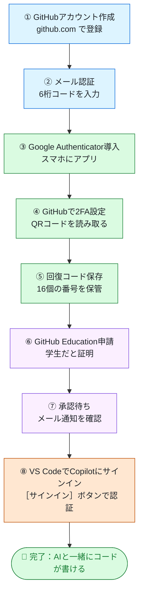
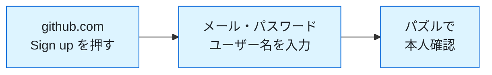
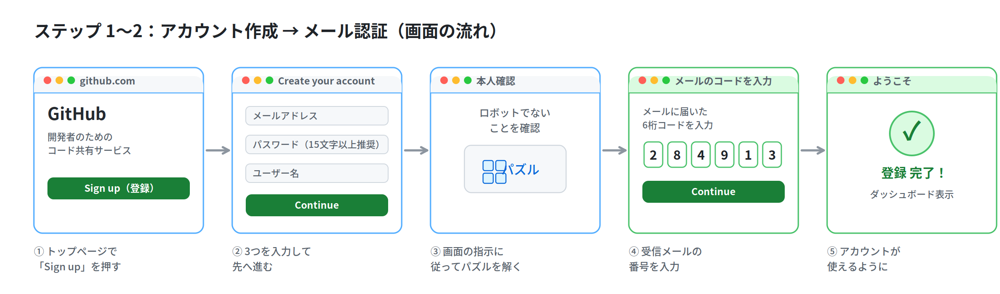
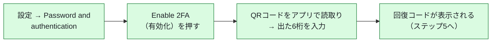
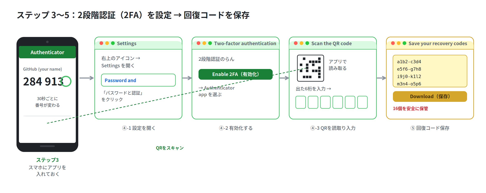
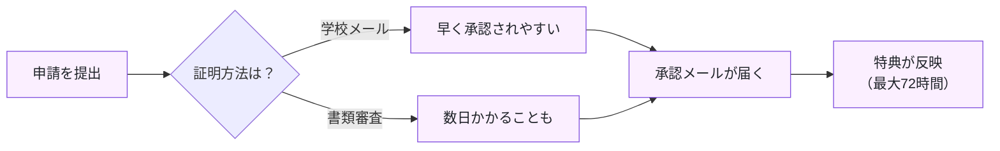
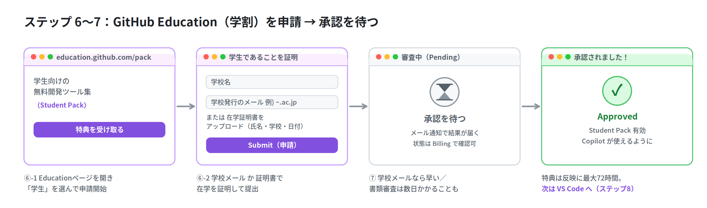
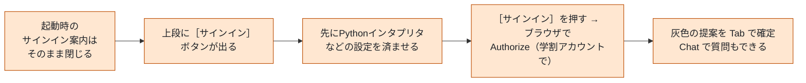
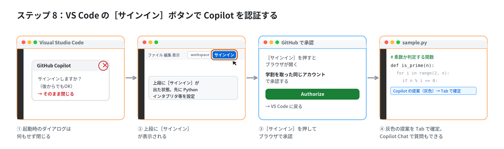

# はじめての GitHub 設定ガイド（学生向け）

> **このガイドについて**
> GitHub をはじめて使う人が、アカウント作成から「VS Code で AI（Copilot）を使える状態」になるまでを、**8 ステップ**でひとつずつ進められるように作っています。画面の流れの図も入れているので、図と本文を見ながら順番に進めてください。

| 項目 | 内容 |
|---|---|
| 対象 | GitHub をこれから初めて使う学生のみなさん |
| 所要時間 | およそ 30〜60 分（学割の承認待ちを除く） |
| 用意するもの | パソコン・**学校から配られたメールアドレス**・**スマートフォン**・VS Code |
| ゴール | GitHub アカウント＋2 段階認証＋学割（GitHub Education）＋VS Code で Copilot が動く状態 |

> ⚠️ 画面のデザインや文言、学割（Copilot）の特典内容は GitHub の都合でしばしば変わります。**ボタンの名前が少し違っても、やることの流れは同じ**です。図の「役割」を手がかりに進めてください。

---

## 全体の流れ（8 ステップ）

まず全体像をつかみましょう。大きく **「①アカウント」→「②セキュリティ」→「③学割」→「④開発環境」** の 4 つのまとまりに分かれています。



> **進め方のコツ**：⑥の学割申請は「承認待ち」の時間が発生します。先に⑥を申請してしまい、待っている間に他の作業を進めると効率的です。ただし、このガイドは初めての人がつまずかないよう、**番号順**で説明します。

---

## ステップ 1：GitHub アカウントを作成する

**目的：** GitHub を使うための「あなた専用のアカウント（IDとプロフィール）」を作ります。



### 手順

1. ブラウザで **https://github.com** を開きます。
2. 右上の **「Sign up」**（登録）ボタンを押します。
3. 次の3つを入力します。
   - **メールアドレス**：学割（ステップ6）も考えると、**学校から配られたメールアドレス**がおすすめです。
   - **パスワード**：**15文字以上**を推奨。大文字・小文字・数字・記号を混ぜると安全です。**必ずメモ**しておきましょう。
   - **ユーザー名**：他の人にも見える「あなたの名前」になります。`firstname-lastname` のように、**就職活動などで見られても良い名前**にしましょう。**後から変えるとURLが全部変わる**ので慎重に。
4. 「あなたはロボットではありません」を確認する**パズル**が出ます。画面の指示どおりに解きます（間違えても何度でもやり直せます）。

### ポイント・注意

- ユーザー名は世界で1つだけ。すでに使われている名前は選べません。
- パスワードとユーザー名は、このあと何度も使います。安全な場所に記録を。

---

## ステップ 2：メールアドレスを認証する

**目的：** 入力したメールアドレスが「本物（あなたが受け取れる）」ことを GitHub に証明します。

### 手順

1. 登録したメールアドレス宛に、GitHub から**確認メール**が届きます。
2. メールに書かれている **6桁の数字コード（launch code）** を確認します。
3. GitHub の画面に、その6桁を入力します。
4. 認証が成功すると、自動的に次の画面（ダッシュボード）に進みます。

### ✅ ステップ 1〜2 の画面の流れ（まとめ）



### つまずいたら

- **メールが届かない**：迷惑メールフォルダを確認。数分待つ。アドレスの打ち間違いがないか確認。
- それでも届かないときは、登録メールアドレスが正しいか見直しましょう。

---

## ステップ 3：Google Authenticator を導入する

**目的：** 次のステップ（2段階認証）で使う「**6桁の認証コードを作るアプリ**」をスマホに入れます。

> **2段階認証（2FA）って何？**
> パスワードに加えて、**スマホが手元にある人だけが入れる**ようにする仕組みです。万一パスワードが他人に知られても、スマホがなければログインできないので、とても安全になります。
> なお、**コードを書く（コミットする）人は GitHub で 2FA が必須**になっています。学割を使う上でも必要なので、必ず設定しましょう。

### 手順

1. スマートフォンのアプリストアを開きます。
   - iPhone：**App Store**
   - Android：**Google Play ストア**
2. **「Google Authenticator」** を検索して、インストールします。
3. アプリを開いておきます（この時点ではまだ何も登録しません。ステップ4でQRコードを読み取ります）。

### ポイント

- Google Authenticator 以外（Microsoft Authenticator、Authy など）でも構いません。これらは **TOTP アプリ**と呼ばれ、**30秒ごとに変わる6桁の数字**を作る役割は同じです。
- アプリは**バックアップ機能があるもの**だと、スマホを買い替えても引き継げて安心です。

---

## ステップ 4：GitHub で 2FA（2段階認証）を設定する

**目的：** GitHub アカウントに「スマホでの本人確認」を追加して、ログインを安全にします。



### 手順

1. GitHub の画面右上の**プロフィール画像**をクリック → **「Settings」**（設定）を開きます。
2. 左のメニューの **「Access」** の中にある **「Password and authentication」**（パスワードと認証）をクリックします。
3. **「Two-factor authentication」**（2段階認証）の欄で **「Enable two-factor authentication」**（2段階認証を有効化）を押します。
4. **「Authenticator app」**（認証アプリ）を選びます。**QRコード**が表示されます。
5. スマホの Google Authenticator を開き、**QRコードを読み取り（スキャン）**ます。
   - QRが読み取れないときは、画面の **「setup key（セットアップキー）を手入力」** から、表示される文字列をアプリに入力してもOKです。
6. アプリに **6桁のコード**が表示されます。その番号を GitHub の入力欄に入力します。
7. 続いて **回復コード（recovery codes）** の画面が出ます → これは**ステップ5**で保存します。

### つまずいたら

- **コードが合わない（authentication failed）**：番号は30秒で変わります。**変わった直後の新しい番号**を、落ち着いて入力しましょう。スマホの時刻が自動設定になっているかも確認を。
- 設定の直後から **28日間の確認期間**があります。期間内に一度ログインで2FAを使えば、設定が正しいことが確認されます。

---

## ステップ 5：回復コードを保存する

**目的：** スマホを失くした・壊した・機種変更したときに、**アカウントに入り直すための「合言葉」**を保管します。これが無いと、最悪アカウントに入れなくなります。**いちばん大事なステップ**です。

### 手順

1. 2FA 設定の最後に表示される **「Save your recovery codes」**（回復コードを保存）の画面で、**16個のコード**が表示されます。
2. **「Download」**（ダウンロード）でファイル保存、**「Print」**で印刷、**「Copy」**でコピーができます。**複数の方法で残す**のがおすすめです。
3. 安全な場所に保管したら、**「I have saved my recovery codes」**（保存しました）を押して設定を完了します。

### ✅ ステップ 3〜5 の画面の流れ（まとめ）



### 保管のルール（とても重要）

- 各コードは **1回だけ**使えます。使い切ったら設定画面から新しい16個を再発行できます。
- **他人に見られない場所**へ。SNSやチャットに貼り付けるのは絶対NG。
- パスワード管理アプリ、印刷して家の安全な場所、などに保管しましょう。
- あとから見直したいときは **Settings → Password and authentication → Recovery codes → View** で確認できます。

---

## ステップ 6：GitHub Education（学割）を申請する

**目的：** 学生であることを証明すると、**GitHub Student Developer Pack**（学生向けの無料ツール集）が使えます。AI コーディングの **GitHub Copilot** も学生向けプランで使えるようになります。

### 手順

1. **https://education.github.com/pack** を開きます。
2. **「学生（Student）」**向けの申請に進みます（"Get student benefits" などのボタン）。
3. 在学していることを証明します。次のどちらかです。
   - **学校から配られたメールアドレス**（例：`〜.ac.jp` など）：いちばん速い方法です。
   - **在学証明書などの書類**をアップロード：**氏名・学校名・現在の年度（または有効期限）**がはっきり写っているものを用意します（学生証、在学証明書、時間割など）。
4. 学校名などの必要事項を入力して、**申請（Submit）**します。

### ポイント

- 申請には **ステップ1で作った個人アカウント**でサインインします（学校が管理する組織アカウントではありません）。
- ステップ2の**メール認証**と、ステップ4の**2FA**が終わっていると、申請がスムーズです。

---

## ステップ 7：承認を待つ

**目的：** GitHub の審査が終わり、特典が使えるようになるのを待ちます。



### 手順・確認方法

1. 承認されると、GitHub から**メール**で通知が届きます。
2. 状態は **https://github.com/settings/education/benefits** でも確認できます。
3. 承認後、**特典が実際に使えるようになるまで最大72時間ほど**かかることがあります。あわてず待ちましょう。

### ✅ ステップ 6〜7 の画面の流れ（まとめ）



### つまずいたら

- **数日たっても結果が来ない**：迷惑メールを確認。上の benefits ページで状態を確認。学校メールがダメなら**書類アップロード**を試す（氏名・学校名・日付が写っているもの）。

> ℹ️ **Copilot の特典について（2026年の状況）**
> 学生向けの Copilot は **「GitHub Copilot Student」プラン**として提供されています。基本的なコード補完やチャットは使えますが、**一部の高性能モデルは自分で選べない**などの制限があります（自動選択モードでは強力なモデルが使われます）。特典の内容は今後も変わる可能性があります。最新の状況は GitHub の案内で確認してください。

---

## ステップ 8：VS Code で Copilot にサインインする

**目的：** ふだん使うエディタ **VS Code** で、AI（GitHub Copilot）のコード補助を使えるようにします。

> **このリポジトリの自動セットアップでインストールした VS Code には、最初から GitHub Copilot の拡張機能が入っています。** そのため、拡張機能を自分でインストールする必要はありません。最後に「サインイン（認証）」だけ行えば使えるようになります。



### 手順

1. VS Code を**初めて起動**すると、**Copilot のサインインを促すダイアログ**が表示されます。ここでは **何もせずにそのまま閉じます**（後からサインインできます）。
2. ダイアログを閉じると、VS Code の**画面上段に［サインイン］ボタン**（GitHub Copilot の認証ボタン）が表示された状態になります。
3. ここで先に、**Python インタプリタの設定**など、ほかの準備を済ませておきます。
4. 準備ができたら、画面上段の **［サインイン］ボタンを押します**。
5. ブラウザが開くので、**ステップ6で学割を取ったのと同じ GitHub アカウント**で **Authorize（承認）** します。
   - ⚠️ **別のアカウントで承認すると Copilot がうまく有効になりません。** 同じアカウントか確認しましょう。
6. VS Code に戻ります。これで準備完了です。

### 動作確認

1. 新しいファイル（例：`hello.py`）を作ります。
2. やりたいことを**コメント**で書きます。例：
   ```python
   # 数を受け取って、素数かどうかを判定する関数
   ```
3. 改行して少し待つと、**灰色の文字**でコードの候補が出ます。**Tab キー**で確定、無視したいときはそのまま入力を続けます。
4. **Copilot Chat**（チャット欄）に「この関数を説明して」などと聞くこともできます。

### ✅ ステップ 8 の画面の流れ（まとめ）



---

## よくあるトラブルと対処

| 困りごと | 主な原因 | 対処 |
|---|---|---|
| 確認メールが来ない | 迷惑メール／アドレス間違い | 迷惑メールフォルダ確認・数分待つ・アドレス再確認 |
| 2FA のコードが合わない | 30秒で番号が変わる／スマホの時刻ずれ | 新しい番号を入力・スマホの時刻を自動設定に |
| スマホを機種変更した | 認証アプリが移っていない | **回復コード**でログイン → 2FAを再設定 |
| 学割が承認されない | 証明が不十分／学校メール不可 | 氏名・学校・日付が写った書類をアップロード |
| 学割は通ったのに Copilot が使えない | 反映待ち／VS Codeのアカウント違い | 最大72時間待つ・**同じアカウント**でサインインし直す |
| Copilot の候補が出ない | サインインしていない／アカウント違い | 画面上段の［サインイン］状態と、サインイン中のアカウントを確認 |

---

## 用語ミニ辞典

| 用語 | かんたんな意味 |
|---|---|
| リポジトリ | コードを入れておく「フォルダ＋履歴」。GitHub の基本単位 |
| 2FA / 2段階認証 | パスワード＋スマホで本人確認する仕組み |
| TOTP アプリ | 30秒ごとに6桁コードを作るアプリ（Google Authenticator など） |
| 回復コード | スマホを失ったときにログインし直すための合言葉（16個） |
| GitHub Education | 学生・教員向けの無料特典プログラム |
| Student Developer Pack | 学生が無料で使える開発ツールの詰め合わせ |
| Copilot | コードの続きを提案してくれる AI。VS Code などで使える |
| 拡張機能（Extension） | VS Code に機能を追加する部品 |

---

## 完了チェックリスト

- [ ] GitHub アカウントを作成した（ユーザー名・パスワードを記録した）
- [ ] メール認証（6桁コード）を済ませた
- [ ] スマホに Google Authenticator を入れた
- [ ] GitHub で 2FA を有効にした
- [ ] 回復コード16個を安全な場所に保存した
- [ ] GitHub Education（学割）を申請した
- [ ] 承認メールが届いた／特典が反映された
- [ ] VS Code で Copilot にサインインした（学割と同じアカウント）
- [ ] コメントから灰色の候補が出ることを確認した

> お疲れさまでした！ ここまで終われば、AI と一緒にコードを書く準備は完了です。
